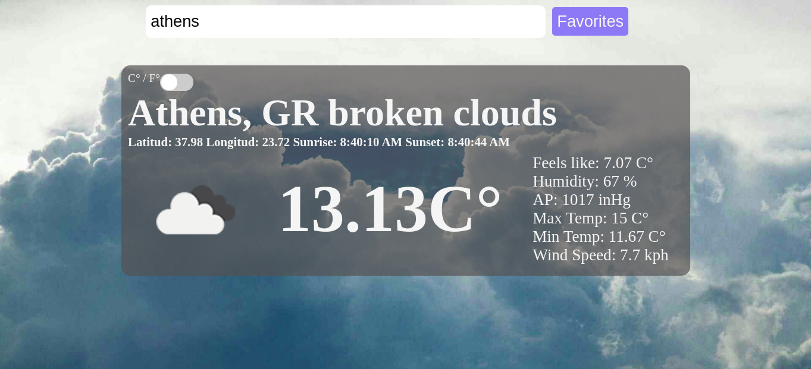

# Weather-App

### What we built

> A current weather check site were users can search by city and add favorites. Weather data gathered from OpenWeatherMap and favorites saved to localStorage.

### Project screenshot




### 📝 Setup

 - Open a terminal
 
 - Clone this code: 
        ```
        git clone https://github.com/jurgen1c/weather-app.git
        ```

- Run the command ```npm install``` from root directory to install the app dependencies.

- Run the command ```npm run build``` to bundle up the files.

- Run the command ```npm run dev``` to test on localhost:8080.


### Build With

-	HTML
- JavaScript
- Webpack
- SASS  

### Check out the live demo [here](https://dazzling-jones-95a292.netlify.app/)     

## 👤 Author


👤 **Jurgen Clausen Gutierrez**

- Github: [@jurgen1c](https://github.com/jurgen1c)
- LinkedIn: [jurgen-clausen](https://www.linkedin.com/in/jurgen-clausen-2740061a9/)

## 🤝 Contributing

Contributions, issues and feature requests are welcome!

Feel free to check the [issues page](issues/).

## Show your support

Give a ⭐️ if you like this project!

## Acknowledgments

- Microverse
- etc

